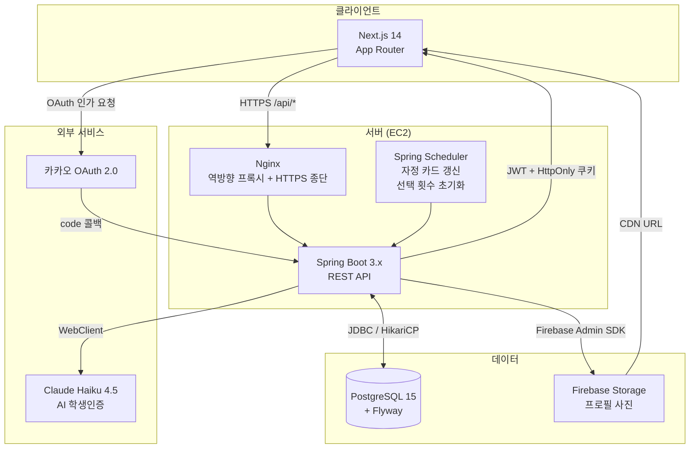
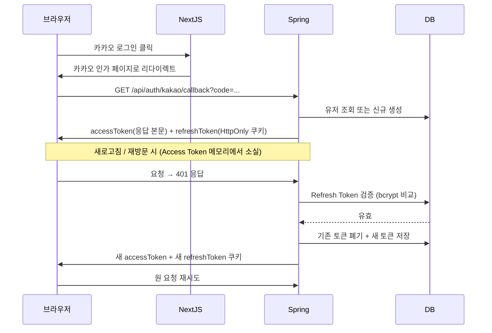
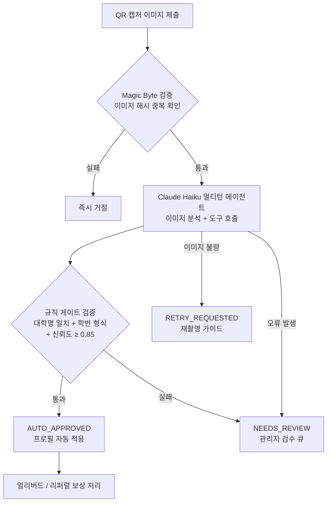

# 캠퍼스한장 (Campus Hanjang)

> **사진 한 장으로 느낌을 보고, 이상형이 맞으면 바로 연결** — 축제 번호 부스의 디지털화

[](https://openjdk.org/)
[](https://spring.io/projects/spring-boot)
[](https://nextjs.org/)
[](https://www.postgresql.org/)

---

## 목차

1. [서비스 소개](#1-서비스-소개)
2. [핵심 기능](#2-핵심-기능)
3. [기술 스택](#3-기술-스택)
4. [아키텍처](#4-아키텍처)
5. [트러블슈팅](#5-트러블슈팅)
6. [ERD](#6-erd)
7. [API 명세](#7-api-명세)

---

## 1. 서비스 소개

**캠퍼스한장**은 세종대학교 재학생만 가입할 수 있는 사진 기반 매칭 서비스입니다.

### 개발 배경

대학 축제의 번호 부스는 수백 명이 줄을 서는 인기 행사지만, 행사가 끝나면 흔적이 남지 않습니다. "딱 한 번의 기회"를 연간 서비스로 확장하면서, 동시에 **재학생임을 증명해야만 접근**할 수 있는 신뢰 기반 공간을 만드는 것이 목표였습니다.

### 타겟 유저

- 세종대학교 재학생 (학생인증 필수)
- 자기 학과 외의 사람과 자연스럽게 인연을 만들고 싶은 대학생

### 서비스 흐름

```
카카오 로그인 → 학생인증(QR 캡처 AI 판정) → 프로필 작성 → 사진 등록 → 특징 입력 → 이상형 설정
→ 매일 자정: 새 카드 10장 제공 → 하루 최대 4회 선택 → 이상형 75% 이상 시 연락처 즉시 공개
```

---

## 2. 핵심 기능

### ① AI 학생인증 — Claude API 멀티턴 에이전트

학생 앱에서 QR 코드 화면을 캡처해 제출하면, Claude Haiku가 이미지에서 이름·학번·학과·생년월일을 추출한 뒤 툴 호출로 학번 중복과 학과 사전을 검증합니다. LLM 판정 결과는 **서버측 규칙 게이트(대학명 일치 + 학번 형식 + 신뢰도 ≥ 0.85)를 반드시 통과해야만** 자동 승인이 확정됩니다.

### ② 일일 매칭 카드 시스템 — Spring Scheduler + 비관적 락

매일 자정 스케줄러가 활성 유저 전원에게 이성 후보 10장을 생성합니다. 이상형 일치율을 미리 계산해 카드에 포함하고, 첫 방문 시 온디맨드 생성을 비관적 락으로 직렬화해 동시 요청으로 인한 중복 생성을 차단합니다.

### ③ 이상형 매칭 점수 분기 — MatchScoreUtil

선택받은 사람의 이상형 조건 vs 선택한 사람의 실제 특징을 **0.0 ~ 1.0** 점수로 계산합니다. **75% 이상**이면 연락처를 즉시 공개하고, **75% 미만**이면 50자 이내 쪽지 작성 UI로 분기합니다.

### ④ 토큰 회전 + 연락처 암호화 — JWT Rotation + AES-256-GCM

Refresh Token은 사용할 때마다 새 토큰으로 교체되고 기존 토큰은 즉시 폐기됩니다. 폐기된 토큰이 재사용되면 모든 세션을 강제 차단합니다. 연락처는 매번 랜덤 nonce를 생성하는 AES-256-GCM으로 암호화해 저장합니다.

### ⑤ 계층형 Rate Limiting — Bucket4j + Caffeine

전역 IP 제한(분당 100회)과 엔드포인트별 유저 제한을 별도로 관리합니다. 특히 학생인증 엔드포인트는 시간당 5회로 제한해 Claude API 과금을 방어합니다.

---

## 3. 기술 스택

### 백엔드

| 기술 | 선택 이유 |
|------|-----------|
| **Java 17** | Record, sealed class, text block으로 DTO와 분기 로직을 간결하게 표현. LTS 주기상 가장 안정적인 선택. |
| **Spring Boot 3.x** | Spring Security 6의 Lambda DSL로 SecurityFilterChain 구성이 명시적. Jakarta EE 9 기반으로 최신 표준 준수. |
| **Spring Data JPA + Flyway** | 엔티티 설계 변경을 마이그레이션 파일로 이력 관리. 팀 없이 혼자 DB 스키마를 점진적으로 발전시키는 데 적합. |
| **Bucket4j + Caffeine** | Redis 없이 JVM 내 Rate Limiting. 비율 제한 만료 버킷을 1시간 TTL로 자동 축출해 메모리 누수 없음. |
| **AES-256-GCM** | CBC와 달리 인증 태그(128bit)로 무결성까지 보장. 매 암호화마다 랜덤 nonce를 생성해 동일 평문도 다른 암호문 생성. |
| **JJWT 0.12** | typ 클레임으로 Access/Refresh 토큰 타입을 구분. token type confusion 공격을 라이브러리 레벨에서 차단. |
| **Firebase Admin SDK** | 이미지를 서버 디스크에 저장하지 않고 메모리 → Firebase로 직행. 스토리지와 CDN을 직접 관리할 인프라 없이 확장성 확보. |
| **Claude Haiku 4.5 (WebClient)** | 이미지 OCR + 학번/학과 툴 호출을 하나의 에이전트 루프로 처리. 속도와 비용 균형상 Haiku 선택. |
| **ImageMagick + TwelveMonkeys** | Java ImageIO가 HEIC를 지원하지 않아 ImageMagick 프로세스 호출로 변환. iPhone Display P3 ICC 프로파일 JPEG는 TwelveMonkeys로 처리. |

### 프론트엔드

| 기술 | 선택 이유 |
|------|-----------|
| **Next.js 14 (App Router)** | Server Component로 초기 HTML 생성 → LCP 개선. 미들웨어 레이어에서 Refresh Token 쿠키만으로 라우트 가드 구현 가능. |
| **TypeScript 5 (strict)** | API 응답 타입(`ApiResponse<T>`)을 공유해 백엔드 계약과 프론트 타입을 동기화. runtime 오류를 컴파일 타임에 차단. |
| **Zustand** | Access Token을 메모리(store 상태)에만 보관하기 위해 선택. Redux의 보일러플레이트 없이 전역 인증 상태 관리. |
| **Axios Interceptor** | 401 응답을 자동 감지해 Refresh Token 쿠키로 재발급 후 실패한 요청들을 큐에서 재시도. 인증 갱신 로직을 각 API 호출에서 분리. |
| **React Hook Form + Zod** | 온보딩 5단계 폼의 유효성 검사를 서버 스키마와 동일한 규칙으로 클라이언트 선검증. 불필요한 API 호출 차단. |
| **heic2any** | iOS 기기에서 파일 선택 시 HEIC가 그대로 오는 경우를 클라이언트에서 JPEG로 변환. 서버 처리 전 선제 대응. |

---

## 4. 아키텍처

### 전체 서비스 구조



### 인증 흐름



### 학생인증 에이전트 흐름



---

## 5. 트러블슈팅

### 1. bcrypt의 72바이트 절단 문제 — Refresh Token 해싱

**문제**
Refresh Token을 DB에 저장할 때 `BCryptPasswordEncoder.encode(token)`을 사용했더니, Spring Security 6.5 업데이트 이후 일부 토큰 비교가 항상 실패했습니다.

**원인 특정**
bcrypt 알고리즘은 입력을 내부적으로 72바이트에서 절단합니다. JWT Refresh Token은 헤더 + 페이로드 + 서명을 포함해 200바이트 이상이 일반적입니다. `passwordEncoder.matches()` 비교는 저장된 72바이트 범위 내 문자열과 대조하지만, Spring Security 6.5부터 이 동작이 엄격해져 초과 분이 있으면 `IllegalArgumentException`으로 실패합니다.

**해결 방법 선택 이유**
저장 시점에 SHA-256으로 토큰을 44자(Base64) 문자열로 압축한 뒤 bcrypt를 적용했습니다. HMAC 대신 SHA-256을 선택한 이유는, 토큰 자체가 충분히 긴 무작위 서명을 포함하고 있어 추가적인 키를 관리하지 않아도 해시 역산 가능성이 없기 때문입니다.

**결과**
Refresh Token 비교 실패 0건. SHA-256 후 bcrypt 저장 패턴을 `JwtProvider`에서 강제하여 향후 같은 실수를 구조적으로 차단.

---

### 2. iOS HEIC / Live Photo 이미지 처리 실패

**문제**
iPhone 기본 카메라 앱으로 촬영한 프로필 사진을 업로드하면 `javax.imageio.IIOException: Not a JPEG file`이 발생하거나, JPEG 변환은 성공해도 색상이 녹색 또는 분홍색으로 왜곡되었습니다.

**원인 특정**
두 가지 독립적인 원인이 있었습니다.
1. **HEIC/HEIF**: Java 표준 ImageIO가 지원하지 않는 포맷. `Content-Type: image/heic`를 신뢰하면 JPEG인 척 업로드된 파일을 처리하지 못함.
2. **색상 왜곡**: iPhone이 저장하는 JPEG의 ICC 프로파일이 `Display P3` (와이드 색역)인데, 기본 ImageIO는 `sRGB`로 처리해 색상 공간 변환 없이 픽셀값을 그대로 씀.

**해결 방법 선택 이유**
- HEIC: magic byte(바이너리 브랜드 필드 `heic`, `heis`, `hevc` 등)로 포맷을 확인한 후 `ImageMagick`을 서버 프로세스로 실행해 메모리 파이프로 JPEG 변환. 디스크에 임시 파일을 쓰지 않는 방식을 선택한 이유는, 임시 파일 경로 경쟁이나 정리 누락으로 인한 디스크 소진을 원천 차단하기 위해서.
- 색상 왜곡: `TwelveMonkeys ImageIO` 라이브러리를 추가해 P3 → sRGB ICC 프로파일 변환을 자동 처리. Apache Commons Imaging 등 대안 대비, Java ImageIO 플러그인 방식이라 기존 코드 수정 없이 classpath에 JAR 추가만으로 적용 가능.

**결과**
iPhone 15 Pro(HEIF), iPhone SE(HEIC), Live Photo(MOV 첫 프레임) 세 케이스 모두 색상 정확한 JPEG 저장 성공. 서버 디스크 임시 파일 0개 유지.

---

### 3. 동시 선택 요청으로 하루 제한 초과

**문제**
부하 테스트 중 동일 유저가 0.1초 간격으로 선택 요청 2건을 동시에 보내면, `daily_select_count`가 최대치(3)임에도 두 요청이 모두 통과해 4번째 선택까지 성공했습니다.

**원인 특정**
`MatchService.select()` 내부에서 `user.getDailySelectCount()`를 읽은 뒤 `user.incrementSelectCount()`를 호출하기까지의 간격에, 두 번째 트랜잭션이 아직 갱신 전인 값을 읽어 두 요청 모두 "한도 미만"으로 판단했습니다. JPA 낙관적 락(`@Version`)도 고려했지만, 버전 충돌 예외 발생 후 재시도 로직까지 구현해야 하는 복잡성이 있었습니다.

**해결 방법 선택 이유**
`entityManager.lock(user, LockModeType.PESSIMISTIC_WRITE)`로 유저 행에 SELECT FOR UPDATE를 적용했습니다. 선택 횟수 갱신은 하루 최대 4회로 극히 드문 연산이기 때문에, 비관적 락으로 인한 처리량 저하가 사실상 없는 반면 동시성 버그를 코드 변경 없이 완전 차단할 수 있었습니다. 온디맨드 카드 생성 시 중복 생성을 막는 로직에도 동일 방식을 적용했습니다.

**결과**
동시 선택 100회 반복 테스트에서 하루 제한 초과 0건. 재선택(같은 후보를 다시 선택)은 멱등 처리로 횟수 차감 없이 기존 결과 반환.

---

### 4. Access Token 탈취 대응 — 메모리 보관 + Refresh Token 회전

**문제**
초기 설계에서 Access Token을 `localStorage`에 저장했는데, XSS 취약점이 하나라도 존재하면 30일짜리 Refresh Token까지 포함한 모든 토큰이 탈취될 수 있다는 리뷰를 받았습니다.

**원인 특정**
`localStorage`는 JavaScript로 직접 접근 가능해 XSS 공격 시 토큰 탈취가 즉시 가능합니다. HttpOnly 쿠키는 JavaScript에서 읽을 수 없어 XSS의 직접 탈취 경로를 차단합니다.

**해결 방법 선택 이유**
- **Access Token → Zustand 메모리(store)**: 새로고침 시 소멸하지만, 401 응답 시 인터셉터가 자동으로 Refresh Token 쿠키로 재발급 요청을 보내므로 UX 저하 없음.
- **Refresh Token → HttpOnly + Secure + SameSite=Strict 쿠키**: JavaScript에서 읽기 불가 → XSS로 탈취 불가. CSRF는 SameSite=Strict가 크로스 사이트 요청 자체를 차단.
- **Refresh Token 회전(Rotation)**: 탈취된 Refresh Token으로 공격자가 새 토큰을 발급받으면, 진짜 사용자의 다음 갱신 요청에서 폐기된 토큰 재사용으로 감지 → 해당 유저의 모든 Refresh Token 즉시 폐기.

**결과**
XSS 발생 시에도 Access Token은 페이지 세션이 살아있는 동안만 유효(15분), Refresh Token은 쿠키 특성상 탈취 자체가 불가. Refresh Token 재사용 감지 알고리즘으로 탈취 후 악용 창을 최소화.

---

### 5. 이미지 해시 없이 LLM 중복 호출로 인한 비용 폭주

**문제**
스테이징 환경 테스트 중 동일한 학생증 이미지를 20번 제출하는 자동화 공격 시나리오에서, Claude API 호출이 20번 전부 발생해 예상치 못한 비용이 청구되었습니다.

**원인 특정**
학생인증 엔드포인트의 Rate Limiting(시간당 5회)이 있었지만, 5회 제한은 다른 계정으로 우회 가능했고, 이미 승인된 이미지를 다른 계정에서 재사용하는 경우를 차단하지 못했습니다.

**해결 방법 선택 이유**
이미지를 수신하는 즉시 SHA-256 해시를 계산해 `student_verifications.image_hash` 컬럼에 저장합니다. LLM 호출 전 동일 해시가 이미 존재하면 즉시 거절합니다. 해시 계산은 수 밀리초 이내로, 이미지를 디코딩하거나 스토리지에 저장하는 것보다 수십 배 빠릅니다. 해시 충돌을 피하기 위해 SHA-256(충돌 확률 2⁻¹²⁸)을 선택했습니다.

**결과**
중복 이미지 제출 시 Claude API 호출 0건. CLAUDE.md에 "이미지 해시 중복 검사 없이 LLM 호출 금지"를 Non-Negotiable 규칙으로 명문화.

---

## 6. ERD

```mermaid
erDiagram
    users {
        uuid id PK
        bigint kakao_id UK
        varchar nickname
        varchar gender
        date birth_date
        varchar university
        varchar contact_type
        text contact_value_encrypted
        int daily_select_count
        boolean is_early_bird
        boolean is_student_verified
        varchar verified_department
        varchar dept_filter_mode
        timestamp created_at
    }

    user_traits {
        uuid id PK
        uuid user_id FK
        varchar trait_key
        varchar trait_value
        boolean is_visible
    }

    ideal_traits {
        uuid id PK
        uuid user_id FK
        varchar trait_key
        varchar trait_value
    }

    daily_cards {
        uuid id PK
        uuid user_id FK
        uuid candidate_id FK
        date card_date
        float match_score
        boolean is_viewed
        timestamp created_at
    }

    selections {
        uuid id PK
        uuid selector_id FK
        uuid selected_id FK
        float match_score
        varchar type
        timestamp created_at
    }

    notes {
        uuid id PK
        uuid selection_id FK
        varchar content
        varchar status
        timestamp created_at
    }

    student_verifications {
        uuid id PK
        uuid user_id FK
        varchar status
        varchar extracted_name
        varchar extracted_student_no
        varchar extracted_department
        date extracted_birth_date
        float confidence_score
        jsonb agent_actions
        varchar image_hash
        int processing_ms
        int llm_calls
        timestamp created_at
    }

    departments {
        uuid id PK
        varchar name UK
        timestamp created_at
    }

    referral_events {
        uuid id PK
        uuid referrer_id FK
        uuid referee_id FK UK
        varchar status
        date rewarded_at
        timestamp created_at
    }

    withdrawal_blocklist {
        uuid id PK
        varchar kakao_id_hash UK
        timestamp reregistration_allowed_at
    }

    users ||--o{ user_traits : "보유"
    users ||--o{ ideal_traits : "설정"
    users ||--o{ daily_cards : "제공됨"
    users ||--o{ selections : "선택함(selector)"
    users ||--o{ selections : "선택받음(selected)"
    selections ||--o| notes : "쪽지"
    users ||--o{ student_verifications : "인증 기록"
    users ||--o{ referral_events : "초대함(referrer)"
    users ||--|| referral_events : "초대받음(referee)"
```

---

## 7. API 명세

### 인증 (Auth)

| Method | Endpoint | 설명 | 인증 |
|--------|----------|------|------|
| `GET` | `/api/auth/kakao` | 카카오 OAuth 인가 URL 리다이렉트 | 불필요 |
| `GET` | `/api/auth/kakao/callback` | OAuth 콜백 처리 → JWT 발급 | 불필요 |
| `POST` | `/api/auth/refresh` | Refresh Token으로 Access Token 갱신 | 쿠키 |
| `POST` | `/api/auth/logout` | 로그아웃 + Refresh Token 폐기 | Bearer |
| `DELETE` | `/api/auth/withdraw` | 회원 탈퇴 + 24시간 재가입 차단 | Bearer |

### 유저 (User)

| Method | Endpoint | 설명 | 인증 |
|--------|----------|------|------|
| `GET` | `/api/users/me` | 내 프로필 조회 | Bearer |
| `PUT` | `/api/users/me/profile` | 닉네임·연락처 수정 | Bearer |
| `PUT` | `/api/users/me/traits` | 특징 수정 | Bearer |
| `PUT` | `/api/users/me/ideal` | 이상형 수정 | Bearer |
| `PUT` | `/api/users/me/dept-filter` | 학과 필터 설정 변경 | Bearer |

### 사진 (Photo)

| Method | Endpoint | 설명 | 인증 |
|--------|----------|------|------|
| `POST` | `/api/photos/upload` | 프로필 사진 업로드 (최대 10MB) | Bearer |
| `DELETE` | `/api/photos` | 프로필 사진 삭제 | Bearer |

### 학생인증 (Verification)

| Method | Endpoint | 설명 | 인증 |
|--------|----------|------|------|
| `POST` | `/api/verification/submit` | QR 캡처 이미지 제출 → AI 판정 | Bearer |
| `GET` | `/api/verification/status` | 내 인증 상태 조회 | Bearer |

### 매칭 (Match)

| Method | Endpoint | 설명 | 인증 |
|--------|----------|------|------|
| `GET` | `/api/match/cards` | 오늘의 카드 목록 + 남은 선택 횟수 | Bearer |
| `POST` | `/api/match/select` | 카드 선택 → 연락처 공개 또는 쪽지 분기 | Bearer |
| `POST` | `/api/match/note` | 쪽지 전송 (50자 이내) | Bearer |
| `GET` | `/api/match/received/contacts` | 수신함: 연락처 열람자 목록 | Bearer |
| `GET` | `/api/match/received/notes` | 수신함: 쪽지 목록 | Bearer |

### 관리자 (Admin)

| Method | Endpoint | 설명 | 인증 |
|--------|----------|------|------|
| `GET` | `/api/admin/verification/queue` | 검수 대기 목록 | Admin |
| `POST` | `/api/admin/verification/{id}/approve` | 수동 승인 | Admin |
| `POST` | `/api/admin/verification/{id}/reject` | 거절 + 사유 | Admin |
| `GET` | `/api/admin/verification/stats` | 자동승인율·처리시간·큐 크기 | Admin |

### 서비스 상태

| Method | Endpoint | 설명 | 인증 |
|--------|----------|------|------|
| `GET` | `/actuator/health` | DB·Firebase 연결 상태 포함 헬스체크 | 불필요 |
| `GET` | `/api/service-status` | 서비스 상태 + 회원 수 | 불필요 |

---

## 개발 기간 및 역할

| 항목 | 내용 |
|------|------|
| 기간 | 2026.03 ~ 2026.10 |
| 팀 구성 | FE/BE 1인 (풀스택) |
| 담당 | 기획·설계·백엔드·프론트엔드·인프라 전 영역 |
